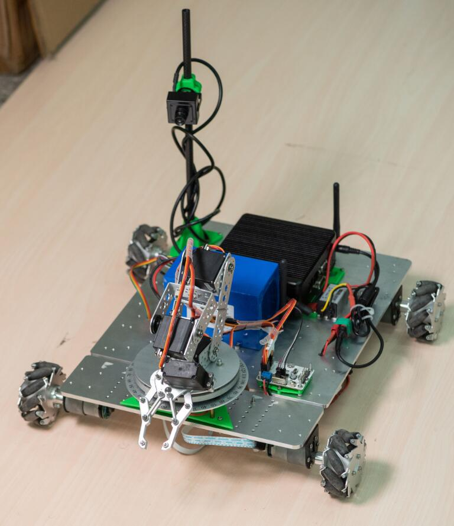
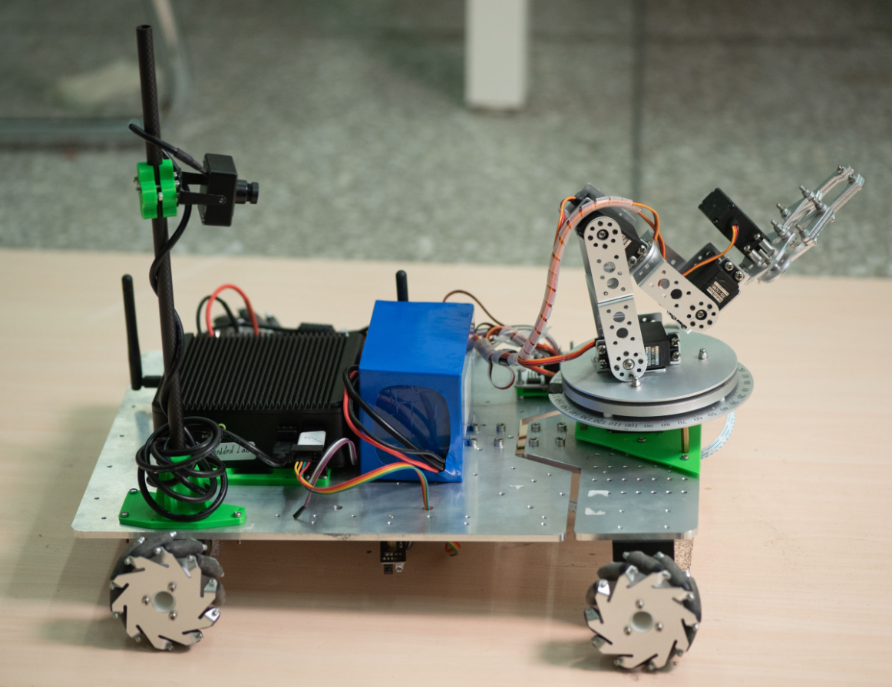
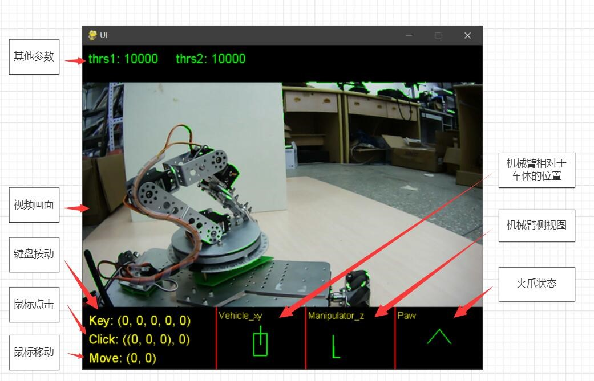

# Mars-Exploration-WAN
2020全国大学生计算机设计大赛
+ 84994：远在千里之外的手
# 总体设计

# 详细设计
+ PC客户端  
  + 前端设计  
    + 视频画面
    + 鼠标&键盘事件
    + 机械臂状态显示
  + 后端设计  
    + tcp客户端
    + 多通道数据融合
+ 云服务器
  + frp反向代理
+ 执行端
  + 工控机服务端
    + tcp服务端
    + mjpg-streamer-图传部署
  + stm32驱动端
    + 4自由度舵机机械臂
    + 全向移动麦克纳姆轮
    + 红外避障模块
    + 通信实时性检测
# 效果图
 
 

